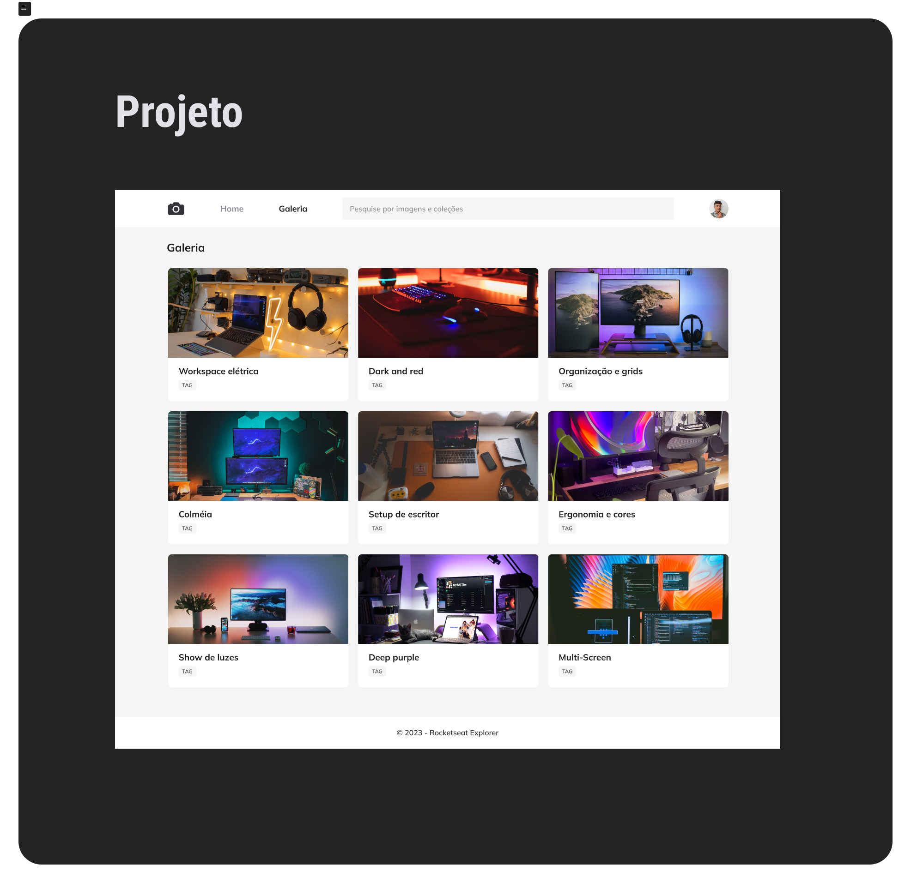

# Projeto Fotoblog - Rocketseat Explorer

#### Projeto construido com HTML e CSS

Projeto feito em aula, para aplicação de conhecimento em tags HTML, Unidades de medidas flexíveis em CSS, CSS Grid, CSS Animation. Variáveis em CSS e Cores HSL.

O Layout do projeto foi esse:

